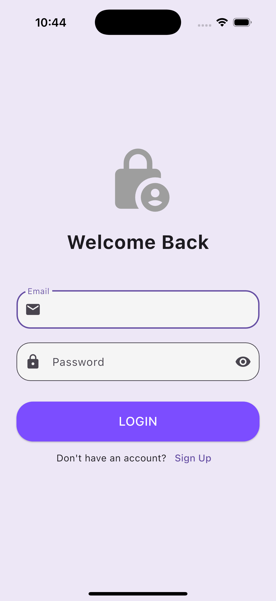
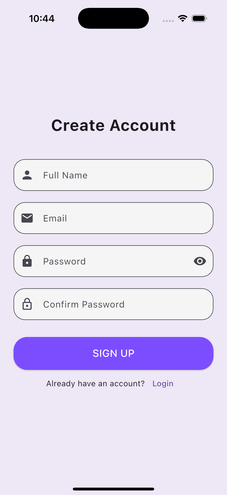

# Login & Signup UI (Flutter)

A clean, modern authentication flow that mimics real-world applications. This project moves beyond simple buttons to handle complex **User Input**, featuring form validation, error handling, and secure password entry.

  
  

## 🎯 Learning Outcomes
By building this project, you will learn:
- **Form Handling:** Using `GlobalKey<FormState>` to validate multiple fields at once.
- **TextFormField:** The difference between a simple TextField and a Form-aware field.
- **Input Validation:** Writing logic to check for valid emails and minimum password lengths.
- **Controllers:** Using `TextEditingController` to read input values (e.g., checking if "Password" matches "Confirm Password").
- **Keyboard Safety:** Wrapping forms in `SingleChildScrollView` to prevent overflow errors when the keyboard pops up.

## 🚀 How to Run

1. **Ensure you are in the project directory:**
    
    `cd flutter_login_signup_ui`
    
2. **Install Dependencies:**
    
    `flutter pub get`
    
3. **Run the App:**
    
    `flutter run`

## 🔙 Back to Main Repo

Find more projects and the full learning roadmap here:
[Flutter Example Apps](https://github.com/thaisangdang/flutter_example_apps)

## 📘 Want to Build Bigger Apps?

This project is just the beginning. If you want to learn how to architect production-ready applications with scalable code, check out my premium guide:

👉 [**Master Flutter Architecture - Build a Production-Ready Social App from Scratch**](https://thaisang.gumroad.com/l/flutter-architecture-build-a-social-app)

## ☕ Support My Work

If you found this project helpful, consider [buying me a coffee](https://buymeacoffee.com/thaisangdang) to keep my work coming!